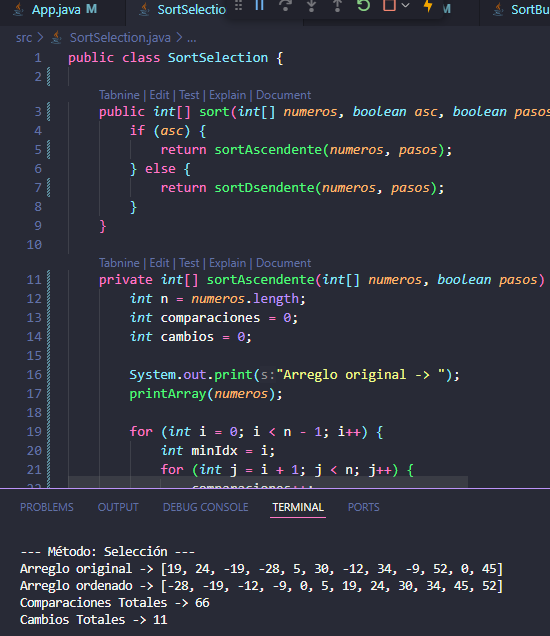

# Métodos de Ordenamiento en Java

Proyecto simple que muestra tres tipos de métodos de ordenamiento implementados en Java:

- **Selección**
- **Inserción**
- **Burbuja**

El programa permite elegir el tipo de ordenamiento, el tipo de orden (ascendente o descendente) y si se quieren ver los pasos del proceso.

## Capturas del programa

### Menú principal

### Método Selección

### Método Inserción

### Método Burbuja

---

Desarrollado como práctica de los métodos básicos de ordenamiento en Java.
